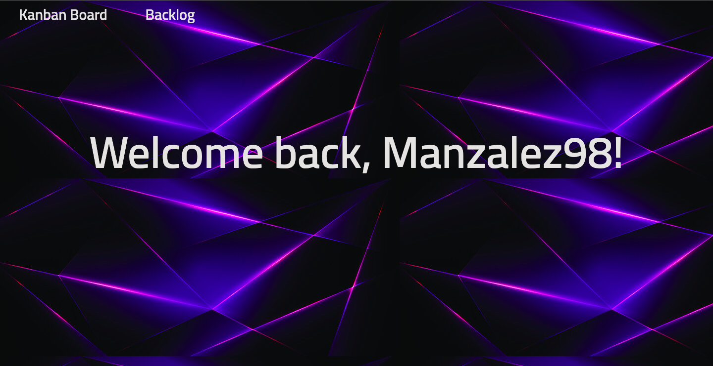

# Kanban Board

## Project Description

The Kanban Board is a personal project management tool designed to replicate the features of popular project management platforms like JIRA, making it a versatile solution for organizing and tracking personal projects with efficiency and precision.

**Key Features:**

| **Feature**                | **Description**                                                                                   | Status |
|---------------------------|---------------------------------------------------------------------------------------------------| ------- |
| **Kanban Board**           | Track tasks, work progress, and projects status. | Complete |
| **Task Management**        | Add, edit, and organize tasks. Set task priorities, and track progress. | In Progress |
| **Sprint Planning**        | Monitor sprint progress and adapt as needed. | To Do |
| **Reporting and Analytics** | Visualize project's performance with reporting and analytics to make informed decisions and improvements. | To Do |

**Homepage** 

**Kanban Board** 

